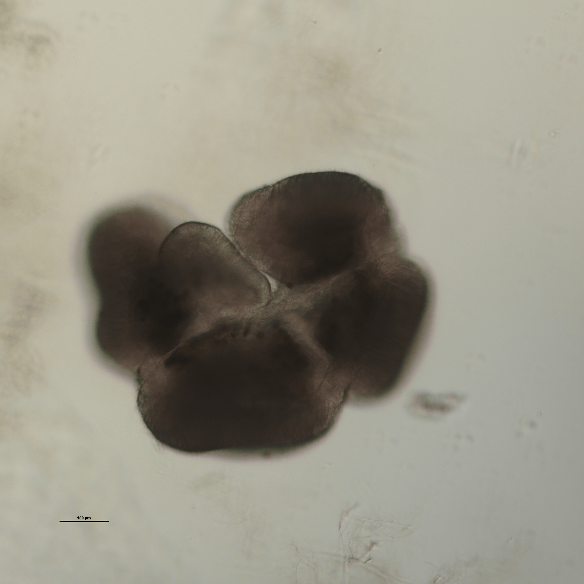
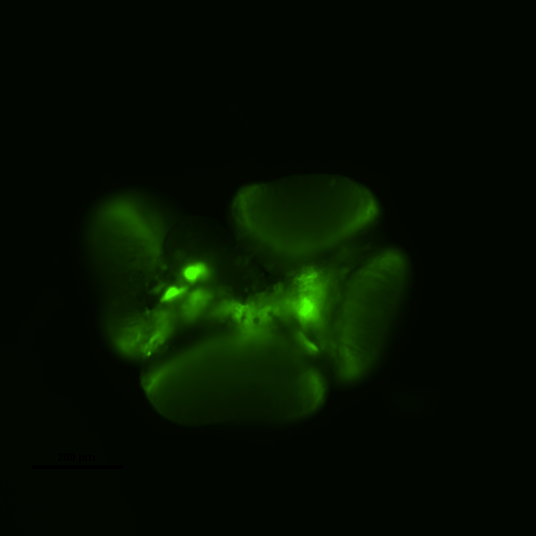
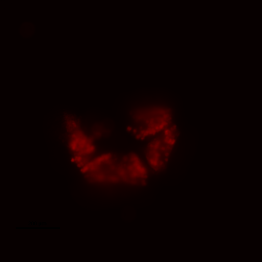
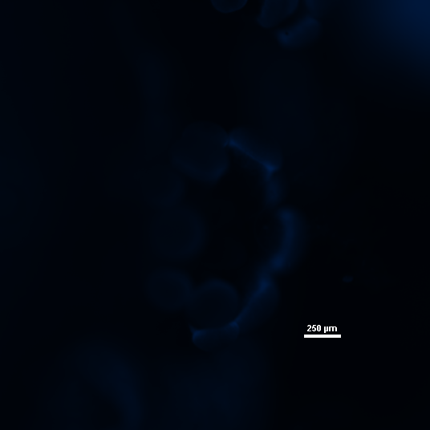
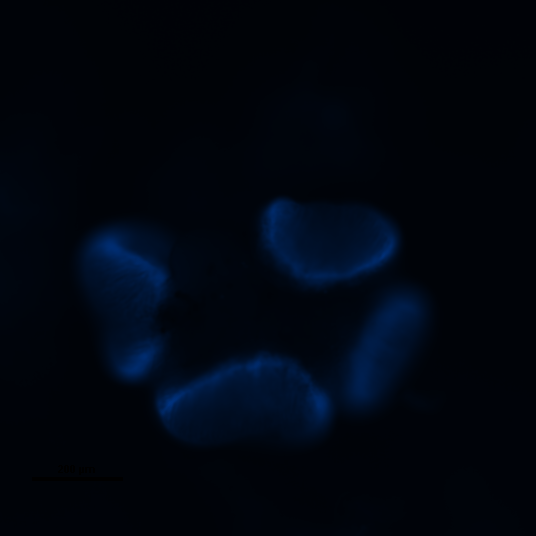
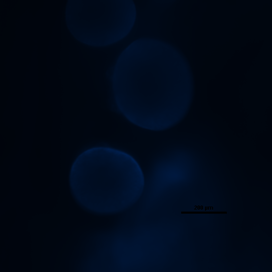
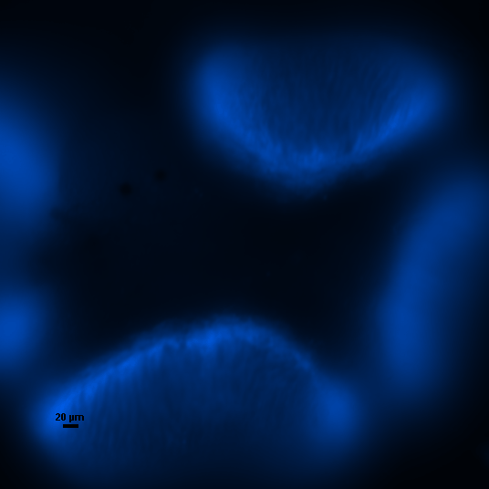

## Using the CNF Polymer with Fluorecent Dye to See Incorperation into Coral Tissue

### Introduction
Cellulose nanofibrils (CNFs) are a polymer that uniquely integrates within the tissues of coral reefs, and when acompanied with a fluorecent dye, this incorperation can be visualized. This system provides a novel approach for tracking the successful delivery and incorperation of compounds into corals. 

### Methods
Small fragments of corals no larger than 0.5 cm, in this case 4 from _Stylophora pistillata_, were cut from a environmentally controlled laboratory aquarium hosting experimental coral subjects. Each fragment was then individually set cut-side down into a well from a 6-well glass plate using fast-setting super glue and covered with artificial sea water (which had previously been filtered through a 0.2 μm filter). Out of the 4 fragments, 1 was treated with 100 μl of the CNF polymer, 1 was treated with 100 μl of the CNF polymer and fluorecent dye, and the remaining 2 were left untreated as controls. These were then imaged under a Nikon Eclipse Ti-E inverted fluorescence microscope and analyzed.

### Results
Upon analyzing the polyp treated with CNF and dye, successful incorperation of the CNF into coral tissues was observed through the fluorecence of the fluorecent dye observed under microscope analysis. Specific fluorecence lenses were applied to investigate the effect of the dye fluorecence under different wavelength colours. In each case, fluorence was present within the coral polyp, confirming CNF had properly integrated, along with the dye, into the coral.

Figure 1: _Stylophora pistillata_ coral polyp with CNF and 0.5 dye visualized under white fluorecence using a Nikon Eclipse Ti-E inverted fluorescence microscope.

Figure 2: _Stylophora pistillata_ coral polyp with CNF and 0.5 dye visualized under green fluorescent protein (GFP) fluorecence using a Nikon Eclipse Ti-E inverted fluorescence microscope.

Figure 3: _Stylophora pistillata_ coral polyp with CNF and 0.5 dye visualized under chloroplast fluorecence using a Nikon Eclipse Ti-E inverted fluorescence microscope.

Figure 4: _Stylophora pistillata_ coral polyp with CNF and 0.5 dye visualized under dapi fluorecence using a Nikon Eclipse Ti-E inverted fluorescence microscope.

Figure 5: _Stylophora pistillata_ coral polyp with CNF and 0.5 dye visualized more enhanced under dapi fluorecence using a Nikon Eclipse Ti-E inverted fluorescence microscope.

Figure 6: _Stylophora pistillata_ coral polyp with CNF and 0.5 dye visualized under dapi fluorecence using a Nikon Eclipse Ti-E inverted fluorescence microscope at x20 magnification.

Figure 7: _Stylophora pistillata_ coral polyp with CNF and 0.5 dye visualized under dapi fluorecence using a Nikon Eclipse Ti-E inverted fluorescence microscope at x40 magnification.

### Discussion
The indication of successful polymer incorperation provides hope that this mechanism can be used to accurately and efficiently monitor the incorperation of substances and molecules, bound to the polymer, into coral and tracked using the fluorecent dye. 

However, significant damage was observed between the coral fragments that were treated versus the controls, with many of the coral polyps in the CNF+dye treatment being retreated, compared to only few in the CNF treatment, and where no polyps were harmed in the controls. This suggests that the concentration of dye applied was harmful to the coral, either initially or following fluorescence exposure by chemical reactions. Thus, less dye should be used in the future. Following analyses should consider a smaller concentrtaion of dye yet still significant enough to view fluoresence.